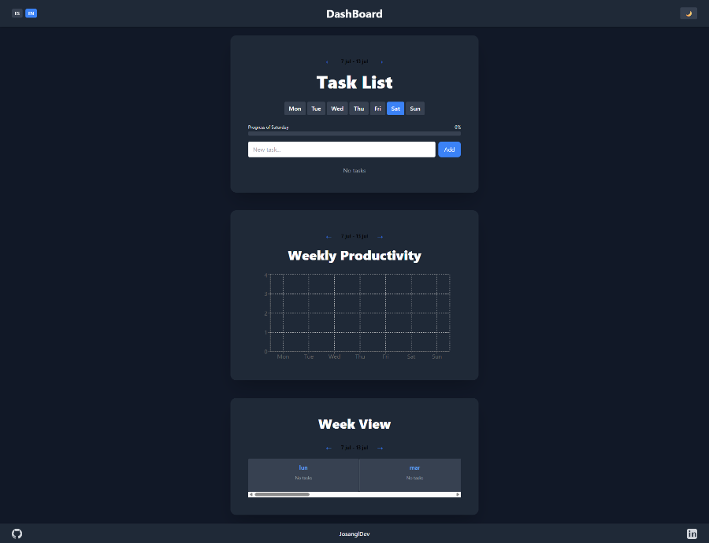

# 📊 Dashboard de Productividad

Este proyecto es una aplicación web moderna y responsive para gestionar tareas y visualizar la productividad semanal, desarrollada con **React**, **Vite**, **TailwindCSS** y **Recharts**.

[🌐 Ver sitio en producción](https://dashboard-productividad.vercel.app/)

---

## 📸 Capturas de pantalla



---

## 🗂️ Estructura y funcionalidades

- **Dashboard principal:** Vista semanal de tareas con navegación intuitiva
- **Gestión de tareas:** Añadir, editar, eliminar y marcar como completadas
- **Vista de productividad:** Gráficos interactivos que muestran el progreso semanal
- **Vista semanal:** Resumen completo de todas las tareas organizadas por día
- **Modo oscuro:** Conmutador de tema con persistencia en localStorage
- **Internacionalización:** Soporte completo para español e inglés
- **Responsive:** Diseño adaptado a móvil, tablet y escritorio

---

## 🚀 Tecnologías y herramientas

- **React 18** — Biblioteca de JavaScript para interfaces de usuario
- **Vite** — Bundler ultrarrápido para desarrollo moderno
- **TailwindCSS** — Framework de utilidades CSS para diseño ágil
- **Recharts** — Biblioteca de gráficos para visualización de datos
- **date-fns** — Utilidades modernas para manipulación de fechas
- **react-i18next** — Sistema de internacionalización completo
- **ESLint** — Linter para mantener calidad del código
- **PostCSS** — Procesador de CSS para optimización

---

## 🧠 Metodología y optimización

- **Hooks personalizados:** `useTasks`, `useLocalStorage`, `useDarkMode`
- **Componentes reutilizables:** Arquitectura modular y mantenible
- **Gestión de estado:** React hooks para estado local y persistente
- **Optimización de rendimiento:** Memoización y lazy loading
- **Accesibilidad:** ARIA labels y navegación por teclado
- **Código limpio:** ESLint configurado y sin duplicados

---

## 🤖 Uso de Inteligencia Artificial

El desarrollo del proyecto ha incorporado el uso de **Inteligencia Artificial** como apoyo para:
- Asistente personal.
- Automatización de tareas repetitivas.
- Refactoring y optimización de código.

---

## 📁 Organización del proyecto

```
├── index.html
├── src/
│   ├── main.jsx              # Punto de entrada de la aplicación
│   ├── App.jsx               # Componente principal
│   ├── App.css               # Estilos específicos de la app
│   ├── index.css             # Tailwind + estilos globales
│   ├── i18n.js              # Configuración de internacionalización
│   ├── components/           # Componentes reutilizables
│   │   ├── TaskList.jsx      # Lista de tareas
│   │   ├── TaskItem.jsx      # Item individual de tarea
│   │   ├── ProgressBar.jsx   # Barra de progreso
│   │   ├── ThemeToggle.jsx   # Conmutador de tema
│   │   ├── ProductivityChart.jsx # Gráfico de productividad
│   │   ├── SkeletonLoader.jsx # Cargador de skeleton
│   │   └── WeekNavigation.jsx # Navegación semanal
│   ├── hooks/               # Hooks personalizados
│   │   ├── useTasks.js      # Gestión de tareas
│   │   ├── useLocalStorage.js # Persistencia en localStorage
│   │   └── useDarkMode.js   # Gestión del modo oscuro
│   └── assets/              # Recursos estáticos
├── public/                  # Archivos públicos
├── docs/                   # Documentación y capturas
├── vite.config.js          # Configuración de Vite
├── tailwind.config.js      # Configuración de Tailwind
├── postcss.config.js       # Configuración de PostCSS
├── eslint.config.js        # Configuración de ESLint
└── package.json
```

---

## 🛠️ Instalación y uso local

1. **Clona el repositorio:**
   ```bash
   git clone https://github.com/JosanglDev/dashboard-productividad.git
   cd dashboard-productividad
   ```

2. **Instala las dependencias:**
   ```bash
   npm install
   ```

3. **Inicia el servidor de desarrollo:**
   ```bash
   npm run dev
   ```
   Abre [http://localhost:5173](http://localhost:5173) en tu navegador.

4. **Ejecuta el linter:**
   ```bash
   npm run lint
   ```

---

## Build y despliegue

1. **Genera la versión de producción:**
   ```bash
   npm run build
   ```
   Los archivos listos para producción estarán en la carpeta `dist/`.

2. **Vista previa de producción:**
   ```bash
   npm run preview
   ```

3. **Despliegue en Vercel:**
   - Sube el repositorio a GitHub
   - Conecta el repo en [Vercel](https://vercel.com/)
   - Configura el directorio de salida como `dist`
   - ¡Listo! Vercel detecta automáticamente Vite y realiza el despliegue

---

## ✨ Características destacadas

- **📅 Gestión semanal:** Organiza tareas por días de la semana
- **📊 Visualización de datos:** Gráficos interactivos de productividad
- **🌙 Modo oscuro:** Tema oscuro/claro con persistencia
- **🌍 Internacionalización:** Soporte completo para ES/EN
- **📱 Responsive:** Diseño adaptado a todos los dispositivos
- **⚡ Rendimiento:** Carga rápida y animaciones fluidas
- **💾 Persistencia:** Datos guardados en localStorage
- **♿ Accesibilidad:** Navegación por teclado y ARIA labels
- **🎨 UI moderna:** Diseño limpio y profesional

---

## 🔧 Scripts disponibles

- `npm run dev` - Inicia el servidor de desarrollo
- `npm run build` - Genera la versión de producción
- `npm run preview` - Vista previa de la versión de producción
- `npm run lint` - Ejecuta el linter para verificar código

---

## 🎯 Funcionalidades principales

### Gestión de Tareas
- ✅ Añadir nuevas tareas
- ✏️ Editar tareas existentes
- 🗑️ Eliminar tareas
- ☑️ Marcar como completadas
- 📅 Organización por día de la semana

### Visualización
- 📊 Gráfico de productividad semanal
- 📈 Barra de progreso diario
- 📋 Vista semanal completa
- 📱 Diseño responsive

### Personalización
- 🌙 Modo oscuro/claro
- 🌍 Cambio de idioma (ES/EN)
- 💾 Persistencia de preferencias
- 🎨 Interfaz personalizable

---

## 👤 Autor

**José Antonio García López**  
Desarrollador Frontend junior.

- [GitHub](https://github.com/josangldev)
- [LinkedIn](https://www.linkedin.com/in/jos%C3%A9-antonio-garc%C3%ADa-l%C3%B3pez-4ba263347/)

---

## 📄 Licencia

MIT

---

## 🤝 Contribuciones

Las contribuciones son bienvenidas. Por favor, abre un issue o un pull request para sugerir mejoras o reportar bugs.

---

## 📝 Changelog

- ✅ Gestión completa de tareas
- ✅ Visualización de productividad
- ✅ Modo oscuro
- ✅ Internacionalización
- ✅ Diseño responsive
- ✅ Optimización de código 